# Where personal names sit in the residual stream

## Abstract

This paper asks where given names sit in the internal representation of five language models: distilgpt2, SmolLM2-360M, Qwen3-0.6B, Qwen2.5-0.5B, and Qwen2.5-1.5B. The readout is the residual stream on the tokenizer pieces of the name. Gisu, Kinyarwanda, Luganda, Lusoga, Runyankore, and Swahili each occupy a centroid, and those six centroids span one subspace in every model. Latin-script control names sit off that subspace by 1.4 to 2.0 language-gaps. Inside the subspace they land among the six languages, so a plot of the plane looks mixed, and a six-way probe with no control class still assigns every control name to one of the six. The same map appears in a second sentence. The off-plane location is spelling: projecting character 2–3 grams out of the residual removes it.

On the four models under 1B, that language direction is shared by the attention write and the MLP write. Removing it drops the original language probe to chance. A random subspace of the same size leaves the probe where it was. Copying another language's residual at the name moves the probe toward the source language.

The six languages are also less probable, per character, than the 299 frequent European names, including after piece count and length are accounted for. On the sentence "was hired" versus "was rejected", the frequent names are favored in every model. Replacing the six-language name residual with the frequent-name centroid reverses that hiring gap on distilgpt2, SmolLM2-360M, and Qwen2.5-1.5B. The exam sentence and the trust sentence change sign across models.

## 1. Question

The names are held fixed and the model is changed. The question is whether the six languages occupy one region of the residual stream, whether the control names share that region, and whether those answers agree across models. A second question uses only the 299 frequent European names as the comparison: whether the name residual makes the six languages less probable, or less tied to a positive continuation, than those frequent names.

## 2. Data and readout

The table has 1,200 prompts and a fixed split, seed `20261002`, with 606 training rows and 594 test rows. Six hundred names are given names in the six languages, 100 each. Six hundred are Latin-script controls matched on character length: 299 frequent European given names and 301 uncommon ones. Mugisha and Rukundo are listed under both Kinyarwanda and Runyankore. Those four rows stay in the training split and are excluded from the six-way probe, which leaves 298 language names and 296 control names in the test set.

The sentence is `The name {name} comes from`. A second sentence, `The person {name} is called`, repeats the map. Activations are the residual block output on the tokenizer pieces inside the name span. Two readouts are reported: the last piece, and the mean of the pieces. The final layer norm is not part of either readout.

The language subspace is the span of the six training language centroids. The control offset is the distance from the control centroid to that subspace, divided by the average gap between the language centroids. A value of 1 means the controls are as close to the subspace as the languages are to each other. The interval is a 400-draw bootstrap that resamples training names within each language. The layer reported in the table is the one with the highest six-way training accuracy. The offset is also measured at every layer.

The comparison with frequent names uses `control_common` only. The 301 uncommon controls stay out of that contrast. Recognition is the sum of token log-probabilities inside the name span, divided by character length, in the dataset sentence. The continuation score is the log probability of a positive ending minus its negative pair, after `The person named {name} `. The three pairs are fixed in advance: passed versus failed the exam, was hired versus was rejected, and is trusted versus is doubted. The gap is the six-language mean minus the frequent-name mean. The interval is a 2,000-draw bootstrap. A second measurement replaces every name piece, at every layer, on the six-language names only, with the frequent-name centroid of the last name piece, and scores the continuations again. A random vector of the same size is the control intervention. Frequent names are left unchanged.

## 3. The six languages share a subspace. The controls sit off it.

The six centroids define the subspace, so their arrangement is the language plane. The control centroid does not lie in it. At the last piece the offset is 1.43 to 1.62 language-gaps. At the mean of the pieces it is 1.73 to 1.97. Every 95% interval is above 1, including the interval for the smallest offset across layers. The five models agree. The second sentence reproduces each offset to within 0.03 gaps.

| Model | Last piece | 95% interval | Mean of pieces | 95% interval |
| --- | ---: | --- | ---: | --- |
| distilgpt2 | 1.62 | 1.48–1.76 | 1.86 | 1.69–2.03 |
| SmolLM2-360M | 1.43 | 1.32–1.54 | 1.78 | 1.62–1.95 |
| Qwen3-0.6B | 1.62 | 1.48–1.75 | 1.97 | 1.77–2.18 |
| Qwen2.5-0.5B | 1.52 | 1.39–1.66 | 1.87 | 1.69–2.05 |
| Qwen2.5-1.5B | 1.44 | 1.32–1.55 | 1.73 | 1.57–1.89 |

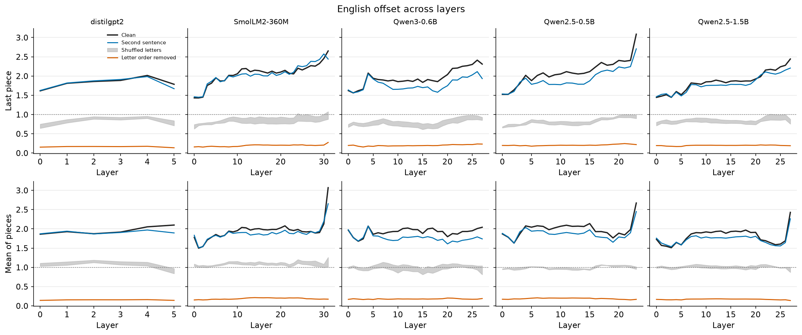

Inside the plane, the test names from the six languages and the control names occupy the same cloud. The separation is the component this plot leaves out.

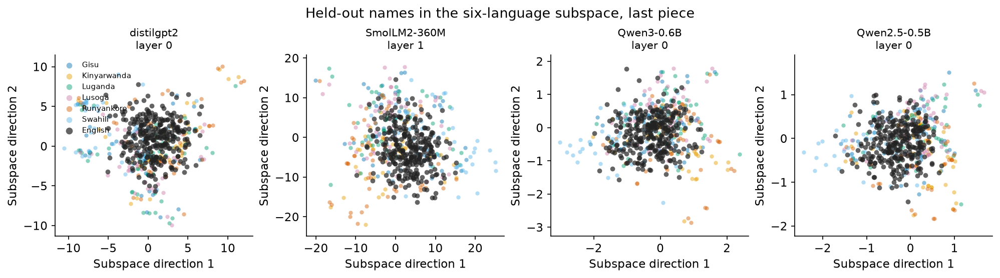

A probe trained only on the six languages has nowhere to put a control name, and it still assigns every control test name to one of the six, at a confidence comparable to the names that belong to those languages. On SmolLM2-360M, Qwen3-0.6B, and Qwen2.5-0.5B, Swahili receives the largest share. On distilgpt2 the assignments are more spread out. This assignment plot is for those four models.

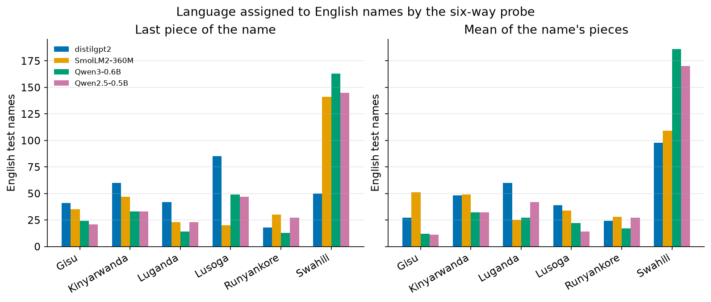

A probe that is given the controls as a seventh class recovers them at about 0.89 to 0.95 recall. The six language centroids span five dimensions. The seven-class probe uses six. The controls add a direction the six languages do not span.

## 4. That direction is spelling

Character 2–3 grams of the name string score 0.544 on the 298 language test names. The last-piece residual probe is below that line on the four models under 1B. At Qwen2.5-1.5B it is 0.527 against 0.544 (p = 0.67). The mean of the pieces is 0.594 at 1.5B (p = 0.11). Reading the residual does not beat reading the letters.

Projecting those character 2–3 grams out of the residual removes the control offset. About 0.1% of the orthogonal distance remains, and the offset falls to 0.14–0.20 gaps. Shuffling the letters inside each name, three times, drops the last-piece offset from about 1.5 gaps to 0.65–0.80. Removing only letter counts, and keeping their order, leaves an offset of 0.53–0.64 and about 26% to 32% of the distance. Letter order is what places the controls off the language plane.

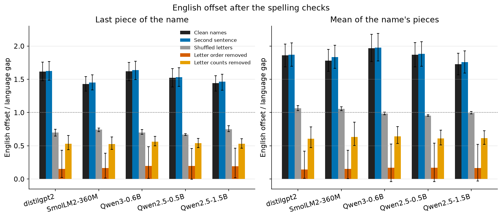

Which of the six languages sit near each other is a second fact about the same representations. The Spearman correlation between centroid gaps and letter-count gaps is 0.54 to 0.84. The correlation with character 2–3 gram gaps is between −0.05 and 0.31, over 15 pairs, and is not significant. Letter counts arrange the six languages inside the plane. Letter order places the controls outside it.

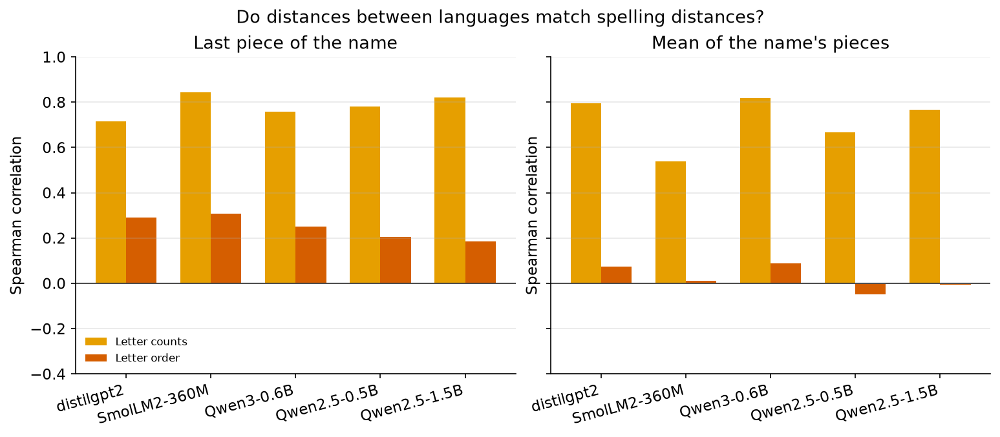

The same comparison, with confusion matrices, is stored for the four models under 1B. There the layer is again chosen on the training split. On distilgpt2 that layer is 0 and the held-out last-piece accuracy is 0.433, while the highest held-out layer is layer 5 at 0.473. Sections 3 and 4 use the training choice. The next section uses the held-out choice, and the two should be kept apart.

## 5. The language direction is in the residual

On the four models under 1B, a six-way probe on the last name piece reaches 0.47 to 0.50 at its best held-out layer. Chance is 0.167. A token-count baseline is 0.28 to 0.31. The mean of the name pieces is higher, 0.52 to 0.58. Swahili recall is 0.68 to 0.84. Gisu recall is 0.34 to 0.38. Attention alone and the MLP alone each carry a language direction, with best accuracies of 0.45 to 0.51.

Removing the five-dimensional language subspace at that best layer drops the original probe to 0.168. Refitting on the ablated residual recovers 0.36 to 0.41. Removing a random subspace of the same size leaves accuracy at 0.44 to 0.51. Removing the single six-languages-versus-control direction leaves the language probe at 0.44 to 0.51, and the binary probe falls to about 0.50. Removing the language subspace leaves the binary probe at 0.96 to 0.98. The language direction and the control direction are different axes.

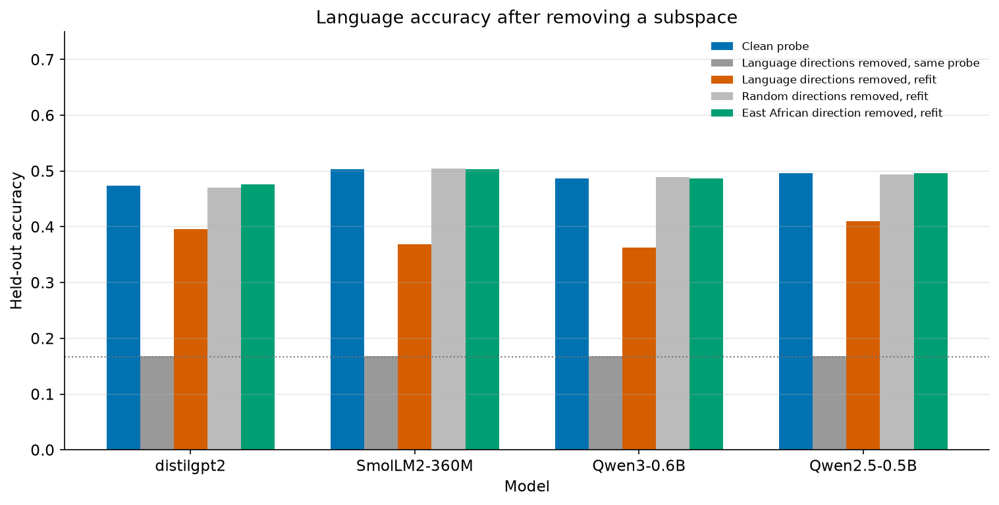

At the same layer, deleting the attention write or the MLP write changes last-piece accuracy by at most 0.03 on three of the four models. On Qwen2.5-0.5B, removing the MLP write drops it from 0.497 to 0.426.

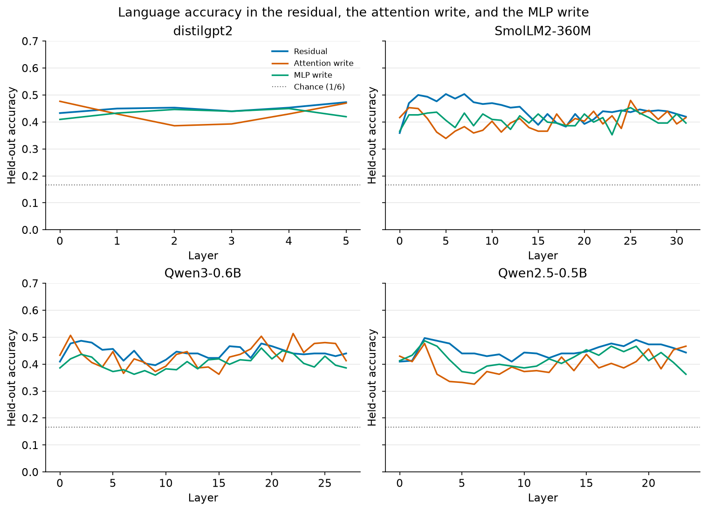

Copying another language's residual onto the name moves the probe toward the source language. At the early peak, destination match falls to 0.12 to 0.25, from a clean destination match of 0.47 to 0.50. On distilgpt2 and SmolLM2-360M the source match is within 0.02 of the source ceiling by layer 3. On SmolLM2-360M and the two Qwen models under 1B, the same transfer at the final layer appears in the last few layers, where clean destination match is 0.42 to 0.44.

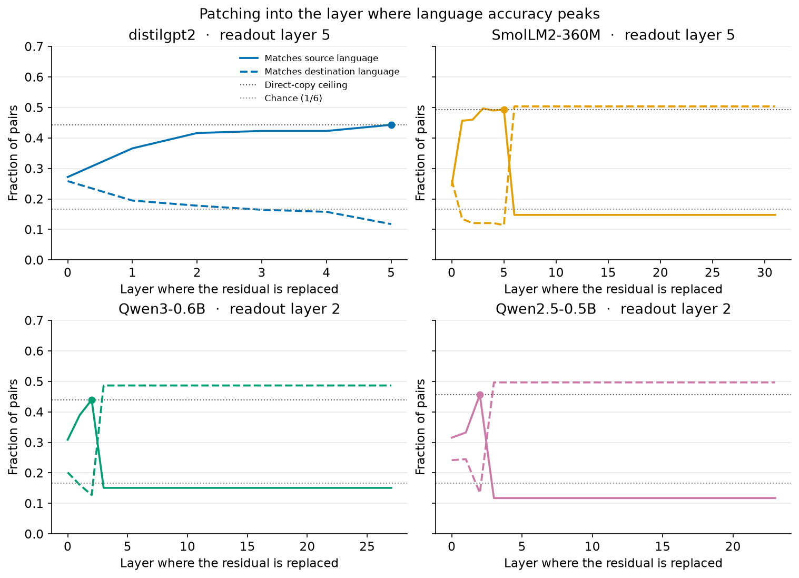

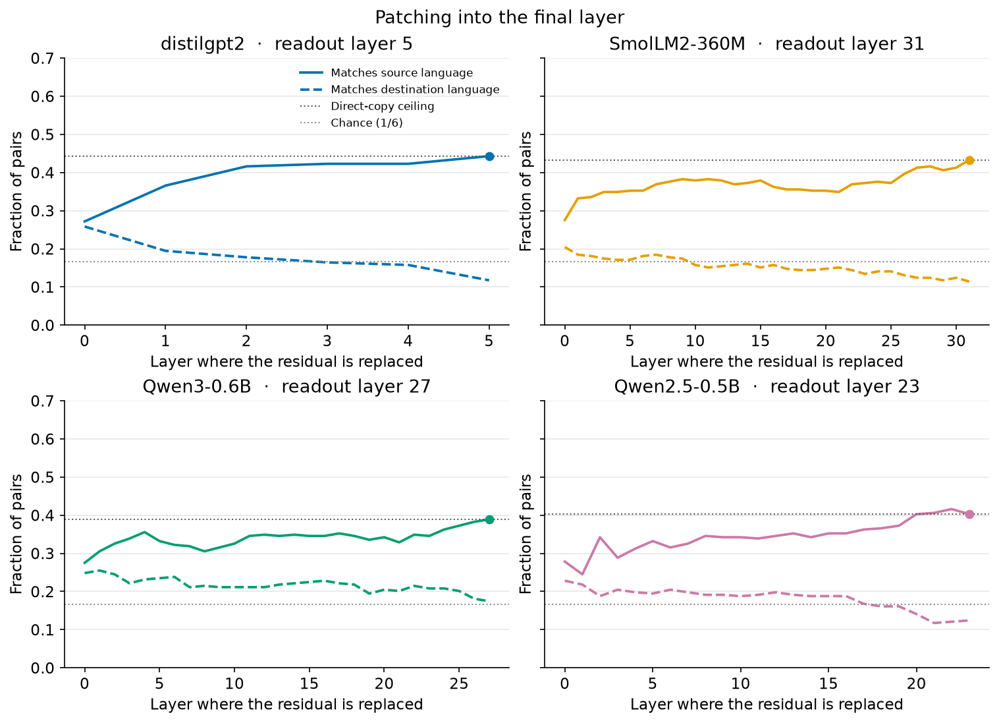

## 6. Frequent names

The six-language names are less probable per character than the 299 frequent names. The gap is 1.50 to 1.88 nats. The six languages also use more tokenizer pieces, by 0.21 to 0.23 pieces per character. After a linear adjustment for piece count and length, 0.41 to 0.54 nats per character remain, and every 95% interval excludes zero.

| Model | Logprob / character | After piece count and length |
| --- | ---: | ---: |
| distilgpt2 | −1.88 | −0.50 |
| SmolLM2-360M | −1.58 | −0.53 |
| Qwen3-0.6B | −1.84 | −0.54 |
| Qwen2.5-0.5B | −1.66 | −0.46 |
| Qwen2.5-1.5B | −1.50 | −0.41 |

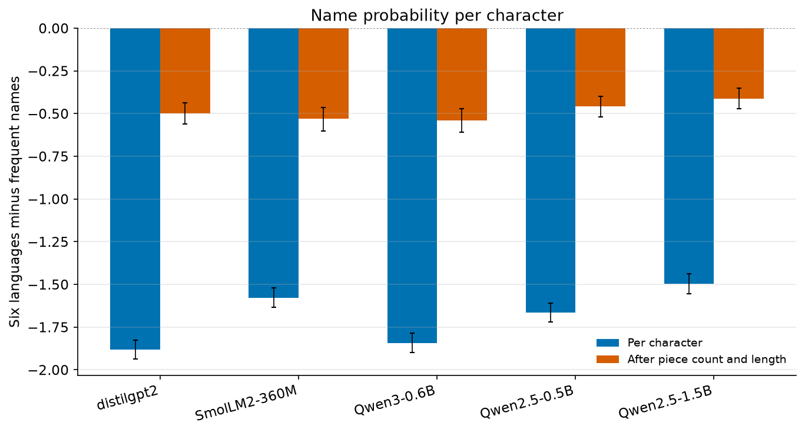

"Was hired" versus "was rejected" favors the frequent names on every model. The gap shrinks after the same adjustment and still excludes zero. Replacing the six-language residual with the frequent-name centroid reverses the gap on distilgpt2, SmolLM2-360M, and Qwen2.5-1.5B. On those three models the random vector leaves the disadvantage in place. Qwen3-0.6B shrinks the gap from −0.73 to −0.45. Qwen2.5-0.5B widens it from −0.95 to −1.39.

| Model | Clean gap | Adjusted | Frequent-name centroid | Random vector |
| --- | ---: | ---: | ---: | ---: |
| distilgpt2 | −0.42 | −0.15 | +0.14 | −0.54 |
| SmolLM2-360M | −1.43 | −0.51 | +0.34 | −1.36 |
| Qwen3-0.6B | −0.73 | −0.29 | −0.45 | −1.45 |
| Qwen2.5-0.5B | −0.95 | −0.30 | −1.39 | −0.75 |
| Qwen2.5-1.5B | −0.68 | −0.15 | +0.71 | −0.79 |

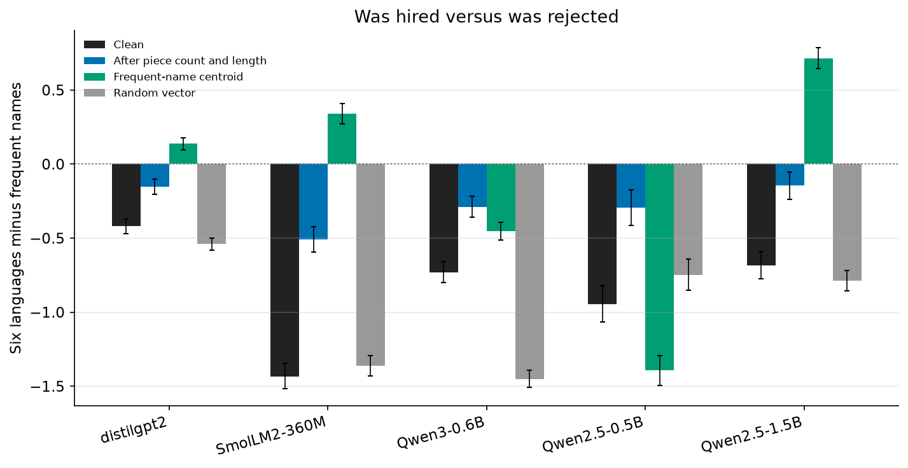

"Passed the exam" versus "failed the exam" changes sign. After the piece-count and length adjustment, SmolLM2-360M, Qwen3-0.6B, and Qwen2.5-0.5B have intervals that include zero. distilgpt2 still favors the six languages, by +0.32. Qwen2.5-1.5B still favors the frequent names, by −0.21.

"Is trusted" versus "is doubted" favors the frequent names on the four smaller models. On Qwen2.5-1.5B it favors the six languages, by +0.18 after adjustment. On SmolLM2-360M the adjusted interval includes zero. The centroid swap widens the trust gap on SmolLM2-360M and Qwen3-0.6B and leaves Qwen2.5-0.5B within 0.02 of its clean gap. On Qwen2.5-1.5B the clean gap is +0.31, toward the six languages, and the swap moves it to −0.10.

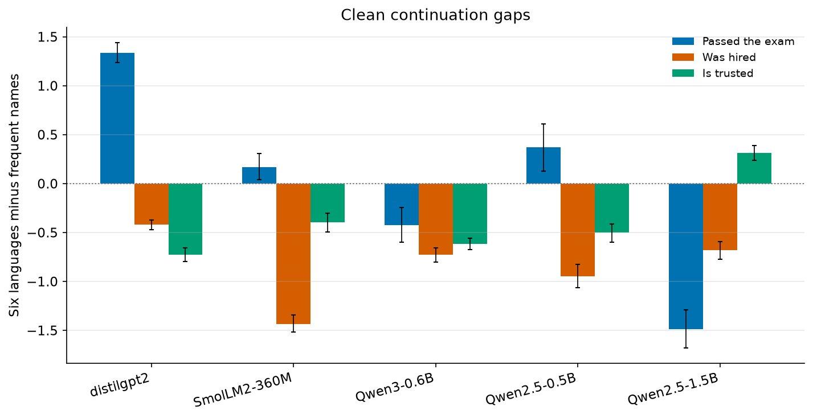

The name residual is causally involved in the hiring continuation on distilgpt2, SmolLM2-360M, and Qwen2.5-1.5B. Recognition stays worse for the six languages on every model. The three sentences together are one hiring effect and two sentences that change sign.

## 7. Scope

The map is the same in all five models and in both sentences. The controls sit off the subspace the six languages span, and they overlap those languages once the view is restricted to that subspace. The off-plane direction is spelling. The language direction and the control direction survive when the other is removed.

Recognition is worse for the six languages on every model, after piece count and length. The hiring continuation is the sentence on which the name residual moves the outcome, and it does so on three of the five models. Gender is recorded on each row and is not in the adjustment.

The sample is about 100 names in each of six languages, in one script. The subspace uses two sentences. The frequent-name comparison uses three continuation pairs, fixed before the run. The ablation, patching, and component checks are the four models under 1B. The largest model is 1.5B parameters.

## Reproducing the figures

`scripts/common.py` loads the table, the split, and the residual layers. `scripts/run_publish.py` writes `results/publish/`. `scripts/run_english_subspace.py` writes the projections and the probe assignments to `results/english_subspace/`. `scripts/run_language_mech.py` writes the ablation, patching, and component checks to `results/language_mech/`. `scripts/run_paper_strength.py` writes the confusion matrices and the paired test to `results/paper_strength/`. `scripts/run_fairness.py` writes the recognition and continuation gaps to `results/fairness/`. The notebook `notebooks/language_visualizations.ipynb` draws the figures and copies the ablation, patching, component, and frequent-name plots into `paper/figures/`. The name table and the split are `data/names.csv` and `data/config.json`.
